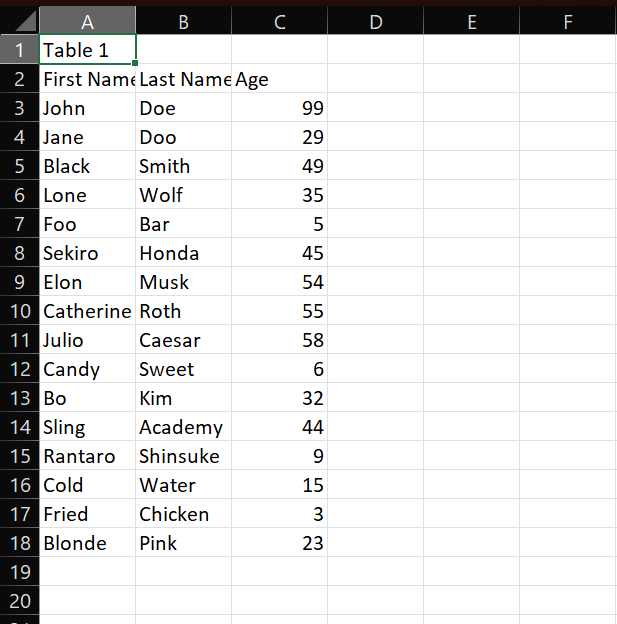

# 🧾 PDF to CSV Extractor CLI Tool

A powerful and customizable CLI tool to extract **tabular data** from PDFs and convert it into clean `.csv` files.

Built using 🐍 Python and ❤️ `pdfplumber` + `Typer` for command-line interface.

---

## 🚀 Features

- ✅ Extract tables from scanned or digital PDFs
- 🔢 Choose specific **page range**
- 🧩 Extract **multiple tables per page**
- 📝 Add optional **Table X** titles between tables
- 🗃 Save **each table in a separate CSV** file
- 🧪 Tested on real-world PDFs (income tax, invoices, bank reports, etc.)

---

## 📁 Folder Structure

```
pdfclitool/
├── extractor/
│   └── pdf_parser.py    # Core table extraction logic
├── pdf/                 # Input PDF files
├── output/              # Output CSV files
├── main.py             # CLI entry point
├── requirements.txt
└── README.md
```

---

## 🧑‍💻 Installation

```bash
# Clone the repo
git clone https://github.com/your-username/pdfclitool.git
cd pdfclitool

# Setup virtual environment (recommended)
python -m venv venv
source venv/bin/activate   # On Windows: venv\Scripts\activate

# Install dependencies
pip install -r requirements.txt
```

## ⚙️ Usage

Basic table extraction from full PDF:

```bash
python main.py --file pdf/sample.pdf --output output/data.csv
```

## 📌 Options

| Option | Description |
|--------|-------------|
| --file | Path to the input PDF file (required) |
| --output | Path to the output CSV file (required) |
| --start-page | Start page (optional, 1-based index) |
| --end-page | End page (optional, 1-based index) |
| --titles | Add Table X titles between tables |
| --separate-files | Save each table into a separate CSV file |

## 🧪 Examples

Extract full PDF into one CSV:

```bash
python main.py --file pdf/temp.pdf --output output/data.csv
```

Extract tables from page 2 to 4:

```bash
python main.py --file pdf/temp.pdf --output output/data.csv --start-page 2 --end-page 4
```

Add Table X titles:

```bash
python main.py --file pdf/temp.pdf --output output/data.csv --titles
```

Save each table in a different file:

```bash
python main.py --file pdf/temp.pdf --output output/data.csv --separate-files
```

All features together:

```bash
python main.py --file pdf/temp.pdf --output output/data.csv --start 1 --end 3 --titles --separate-files
```

## 📄 Sample PDF & Output

You can test the tool using this sample PDF with tables or upload your own.

Sample extracted CSVs will be saved in the `output/` folder.

## 📸 Screenshots

- CLI running


- Output CSV opened in Excel


<!-- ## 📜 License

MIT License. Feel free to fork, improve, and use for your projects! -->

## ✨ Coming Soon

- 🗂 Batch processing of PDFs in a folder
- 🧼 Smart cleaning of headers and empty rows
- 🌐 Simple web UI using FastAPI + React